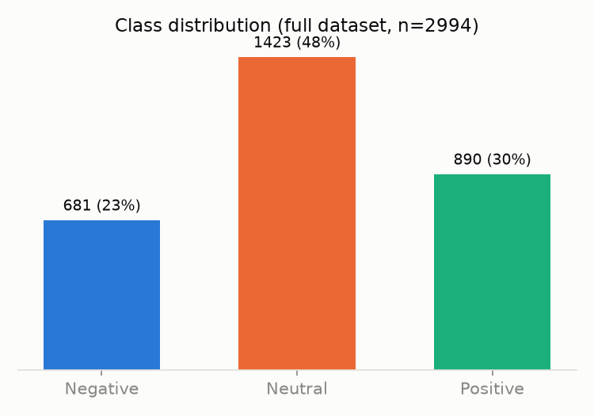
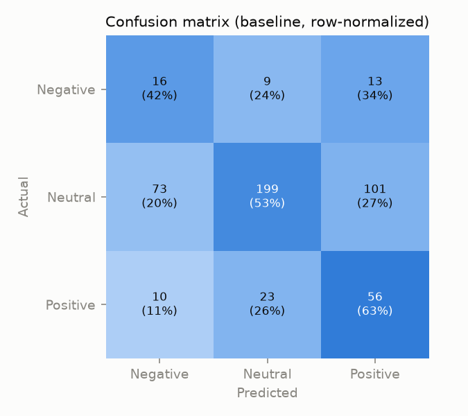

# Crypto Sentiment BERT — Training Write-up

## Overview

This project fine-tunes `bert-base-uncased` into a 3-class sentiment
classifier (**negative / neutral / positive**) for cryptocurrency-related
Reddit comments (BTC, ETH, and general crypto discussion). The fine-tuned
model is published to the Hugging Face Hub at
[`baz08/crypto-Bert-test`](https://huggingface.co/baz08/crypto-Bert-test)
and served behind a FastAPI endpoint (see `deployment/api`).

## Data pipeline

1. **Collection** — `deployment/reddit/redditpushshift.py` pulls BTC/ETH
   comments from r/CryptoCurrency via the Pushshift API.
2. **Cleaning** — `deployment/reddit/cleaner.py` expands contractions,
   lowercases, strips special characters/URLs, and removes stopwords
   (keeping "no"/"not", since they carry sentiment).
3. **Merging & labeling** — `deployment/reddit/merge_clean.py` combines the
   scraped comments with the labeled sets (`sentiment.csv`,
   `sentiment_labels.csv`), normalizes the text, and writes a single
   `Crypto_com.csv` with a `DATA_COLUMN` (text) and `LABEL_COLUMN`
   (0 = negative, 1 = neutral, 2 = positive).

Training uses 2,994 labeled examples, split into a training set and a
500-row held-out evaluation set (the last 500 rows — see `load_dataset()`
in `berttest.py`). The classes are imbalanced:



Neutral is nearly half the dataset; negative is the smallest class at 23%.
Both `berttest.py` and `baseline.py` should be read with that in mind —
plain accuracy is a weaker signal here than per-class recall, especially
for the negative class.

## Model

- **Base**: `bert-base-uncased` via `TFAutoModelForSequenceClassification`
  (3-way classification head).
- **Tokenization**: max length 230 tokens, truncated/padded.
- **Optimizer**: Adam, lr `2e-5`, `epsilon=1e-08`, gradient clipping at
  `clipnorm=1.0` — standard low-LR BERT fine-tuning settings to avoid
  catastrophic forgetting of the pretrained weights.
- **Loss**: sparse categorical cross-entropy.
- **Epochs**: 2, batch size 16.
- **Evaluation**: accuracy, confusion matrix, and per-class
  precision/recall/F1 via `sklearn.metrics` on the held-out split.

Run it with:

```bash
pip install -r requirements.txt
python berttest.py --data ../reddit/Crypto_com.csv --output-dir ./model --push-to-hub baz08/crypto-Bert-test
```

## Baseline vs. BERT

Fine-tuning BERT costs a Hugging Face Hub download plus real training time,
so `baseline.py` gives a cheap TF-IDF + logistic regression reference point
on the exact same held-out split (`load_dataset()` is shared between the two
scripts). Run it with:

```bash
python baseline.py --data ../reddit/Crypto_com.csv
```

Baseline results on the 500-row held-out set:

| | Precision | Recall | F1 | Support |
|---|---|---|---|---|
| Negative | 0.16 | 0.42 | 0.23 | 38 |
| Neutral  | 0.86 | 0.53 | 0.66 | 373 |
| Positive | 0.33 | 0.63 | 0.43 | 89 |
| **Accuracy** | | | **0.542** | 500 |
| Macro avg | 0.45 | 0.53 | 0.44 | 500 |



Reading this: the baseline over-predicts neutral for negative/positive text
(a class-imbalance effect — `class_weight="balanced"` helps recall on the
minority classes but at a real precision cost) and is weakest exactly where
it matters most for a sentiment tool — telling negative from neutral.
54% accuracy against a 48%-neutral majority-class baseline shows the
model is learning *something*, but not much: a linear bag-of-words model on
230-token comments has no way to pick up negation scope, sarcasm, or
crypto-specific slang ("this coin is going to zero" reads lexically similar
to "this coin is going to the moon").

This is the number BERT needs to beat to justify the extra complexity. The
BERT run itself needs a Hugging Face Hub download and wasn't executed as
part of this pass (see Known follow-ups) — `berttest.py`'s `evaluate()` call
prints the same metrics format, so the two are directly comparable once you
run it.

Regenerate both PNGs with:

```bash
python visualize.py --data ../reddit/Crypto_com.csv
```

## Demo

`demo/app.py` is a small Gradio interface over the same `Model` class the
FastAPI service uses (`deployment/api/ML/predmodel.py`) — type in text, get
a sentiment back. Run it locally:

```bash
pip install -r demo/requirements.txt
python demo/app.py
```

It also deploys as-is to a Hugging Face Space: point the Space's app file at
`demo/app.py`. A Space has its own Hub access, so the model download works
there even in environments where it doesn't locally.

## Cleanup notes (this pass)

The original `berttest.ipynb` was an exploratory notebook and has been
replaced by `berttest.py`, a single reusable, argument-driven script. What
changed:

- **Removed the legacy `InputExample`/`InputFeatures` pipeline.** It
  tokenized one example at a time via `tokenizer.encode_plus` in a Python
  loop — slow and effectively deprecated in `transformers`. Replaced with a
  single batched call to the tokenizer plus
  `tf.data.Dataset.from_tensor_slices`, which is simpler and does the same
  job.
- **Fixed a silent 4x-training bug.** The notebook called
  `train_data.shuffle(500).batch(16).repeat(2)` *and* passed `epochs=2` to
  `model.fit`. Since `model.fit` already iterates the dataset once per
  epoch, the extra `.repeat(2)` meant the model actually trained for 4
  effective passes over the data instead of 2. Removed the redundant
  `.repeat()`.
- **Removed dead/unreachable code**, e.g. a self-call to
  `convert_data_to_examples` placed after its own `return` statement, and
  several commented-out, never-run experiments.
- **Removed the hardcoded personal path**
  (`C:/Users/Barrett/mec-mini-projects-master/api/ML`) used to save/reload
  the model. Saving/loading is now controlled by `--output-dir`.
- **Consolidated five overlapping, partly-broken prediction/evaluation
  cells** (including one that referenced a `predicted` column that was
  never created, and another that evaluated a `train_pred` column on a
  DataFrame slice that never had it) into two functions: `predict()`
  (batched inference) and `evaluate()` (metrics on the held-out set).
  Renamed the leftover `gme_df` variable (copy-pasted from an unrelated
  GameStop sentiment project) to `train_df`/`test_df`.
- **Fixed a mislabeled sentiment string.** `deployment/api/ML/predmodel.py`
  returned `"Postive"` instead of `"Positive"` from the live API — one
  character off, but visible in every positive prediction. Fixed.

## Known follow-ups

- No metrics from an actual BERT training/eval run are checked into the
  repo yet — only the baseline's. Run `berttest.py` to get real
  accuracy/F1 numbers for the current model version and paste them in here
  next to the baseline table above. (Not run as part of this pass: it
  needs a Hugging Face Hub download of `bert-base-uncased`, which wasn't
  reachable from the environment this cleanup was done in.)
- No screenshot of the running demo is checked in, for the same reason
  (the model download is required to actually predict anything). Grab one
  after running `demo/app.py` locally.
- A fuller project report already exists at
  `deployment/docs/UCSD ML Capstone.pdf`, if a formal write-up is needed
  beyond this training summary.

## Repo-wide cleanup (later pass)

Beyond the training script itself, a follow-up pass fixed the rest of the
repo for portfolio readiness:

- `deployment/reddit/cleaner.py` imported a nonexistent `contractions`
  module attribute, so the data pipeline (`merge_clean.py`) could never
  actually run — switched to the real `contractions` pip package.
- `deployment/reddit/redditpushshift.py` had a copy-paste bug where
  `ETH_comments.csv` was silently populated with duplicated BTC data.
- Split the single API `requirements.txt` (which mixed API, training, and
  data-pipeline dependencies, several unused) into
  `deployment/api/requirements.txt`, `deployment/bert_training/requirements.txt`,
  and `deployment/reddit/requirements.txt`, and pinned `transformers`/
  `tensorflow` (previously unpinned).
- `predmodel.py`'s `Model` was instantiated eagerly at import time,
  meaning importing the module at all — including for tests — downloaded
  the full BERT model. It's now lazy (built on first request) and loads
  its tokenizer from the fine-tuned Hub repo instead of the base
  `bert-base-uncased` tokenizer.
- Added `tests/` (mocking the model, so the suite runs in seconds) and a
  GitHub Actions CI workflow.

A later pass added the baseline/visuals/demo above, and fixed one more
mismatch found along the way: `merge_clean.py` wrote `Crypto_c.csv` with
`body`/`Sentiment` columns, but `berttest.py` (and the actual data checked
into the repo, `Crypto_com.csv`) expects `DATA_COLUMN`/`LABEL_COLUMN` — the
two had drifted apart and never actually agreed on a filename or schema.
`merge_clean.py` now writes `Crypto_com.csv` with the right column names.
